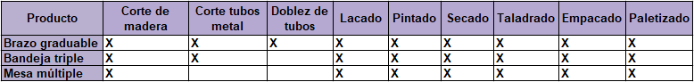

# Esdek - Gestión de producción

## Consideraciones iniciales

Esdek ha decidido fabricar los tres productos que se presentan a continuación:

Estos productos comparten más del 70% de sus materias primas, de acuerdo con la tabla que se presenta a continuación:

Adicionalmente, se identifican los siguientes procesos necesarios para la fabricación de cada producto:

Dado que se comparten una gran cantidad de procesos que pueden ser realizados con las mismas máquinas y equipos de manufactura, se decide fabricar los tres productos de forma simultánea.

### Entrada y salida de material

Con una producción mensual de 800 unidades de cada producto, se requiere:
- 267 láminas de MDF 1.2 x 185 x 244 cm (se obtienen 3 sets de 3 productos de cada lámina)
- 800 tubos de aluminio de 0.5mm x 1m (se obtiene 1 set de 3 productos de cada tubo)
- 2400 cajas de cartón
- 242 litros de laca
- 85 litros de pintura
- 80 kg pegamento PVAc (100g por cada set de productos)
- 38400 tarugos de madera 6 x 30 mm (48 por cada set de productos)
- 12800 tornillos #7 x 3/4" (16 por cada set de productos)

Como salida, se tiene mensualmente una entrega de 2400 productos, 800 de cada tipo.

### Tiempos estimados de producción (planta original)

 
Para el corte manual se realiza con una sierra sin fin. En este proceso, un trabajador suele cortar a una velocidad aproximada de 0.03 m/s. El tiempo entre cortes puede ser de hasta 30 segundos. Para producir 3 productos se requieren realizar 50 cortes, y la longitud total de corte calculada es de 19.7m. Teniendo en cuenta el tiempo que se tarda pegando la plantilla de corte sobre el material (calculado en 180 segundos), y el tiempo que se tarda retirando las piezas tras el corte (calculado en 120 segundos) se obtienen los tiempos:
  Tiempo de corte: 19.7/0.03 = 657 segundos
  Th: 50 * 30 = 1500 segundos
  Tiempo de ciclo: 2157 segundos
  Tiempo de setup: 180 segundos
  Tiempo de recuperación: 120 segundos
  No. Operarios: 1
  No. Maquinas: 1

 
Adicionalmente, sabiendo que la vida útil de la sierra es de 12 horas de corte, se encuentra:
  MTBF: 43200 segundos
  MTTR: 600 segundos
  Disponibilidad: 98.6%

 
En el proceso de lacado (dos capas), un operario suele demorarse 150 segundos por metro cuadrado. Se tiene en cuenta que son 38 piezas de madera, con un área a a lacar de 2.6 metros cuadrados (1.3 cada lado). El cambio entre piezas tarda 10 segundos, y se considera un tiempo de setup de 120 segundos que incluye preparar la laca y herramientas, así como disponer las piezas. Además, se otorgan 15 minutos de secado (recovery time).
  Tiempo de lacado: 2.6*150 = 390 segundos
  Th: 38 * 10 = 380 segundos
  Tiempo de ciclo: 770 segundos
  Tiempo de setup: 120 segundos
  Tiempo de recuperación: 900 segundos
  No. Operarios: 1
  No. Maquinas: 0

 
Para el pintado, se tienen los mismos tiempos de cambio de pieza, setup, y recuperación de la operación de lacado. En cuanto al tiempo de pintado, es de 125 segundos por metro cuadrado. El área es la misma, de donde resulta:
  Tiempo de pintado: 2.6*150 = 325 segundos
  Th: 38 * 10 = 380 segundos
  Tiempo de ciclo: 705 segundos
  Tiempo de setup: 120 segundos
  Tiempo de recuperación: 900 segundos
  No. Operarios: 1
  No. Maquinas: 0

 
El corte de tubos de metal se realiza con una tronzadora, donde el operario es quien maneja las distancias y realiza el corte. Para cada set de productos se necesitan 18 tubos de 2.4cm, 1 de 26cm y 1 de 7.2cm, es decir, se requiere realizar 20 cortes. El tiempo de cada corte es de 3 segundos, y el de manipulación entre cortes es de 6 segundos. El setup time está dado por el tiempo de encendido de la máquina y de ubicación del tubo, y se estima en 40 segundos. El tiempo de recuperación se estima en 30 segundos. Así, resulta:
  Tiempo de corte: 3*20 = 60 segundos
  Th: 20 * 5 = 120 segundos
  Tiempo de ciclo: 180 segundos
  Tiempo de setup: 40 segundos
  Tiempo de recuperación: 30 segundos
  No. Operarios: 1
  No. Maquinas: 1

 
El doblez de tubos de metal únicamente se necesita para un tubo (el de 26 cm). Se realizan manualmente 4 dobleces, cada uno tarda 2 segundos, y el tiempo de medición y manipulación del tubo se estima en 18 segundos entre dobleces. Debido a que es solo una pieza que se dobla con soportes mecánicos, tanto el tiempo de setup como de recuperación son de solo 15 segundos cada uno.
  Tiempo de doblez: 2*4 = 8 segundos
  Th: 4 * 18 = 72 segundos
  Tiempo de ciclo: 140 segundos
  Tiempo de setup: 15 segundos
  Tiempo de recuperación: 15 segundos
  No. Operarios: 1
  No. Maquinas: 1

 
El taladrado ocupa 4 segundos por cada agujero. A esto se le suma por cada agujero 20 segundos de medición y marcación, y 10 segundos de manipulación de la herramienta (taladro). También se considera que se cambia dos veces la broca, en lo cual el operario tarda 45 segundos cada vez. La cantidad total de agujeros es de 174, Se supone un tiempo de setup de 120 segundos en el que se conecta el taladro y se ajusta la broca, así como un tiempo de recuperación de 20 segundos, en el que se desconecta la herramienta.
  Tiempo de taladrado: 4*174 = 696 segundos
  Th: 20 * 174 = 3480 segundos
  Tth: 10*174 + 2*45 = 1830 segundos
  Tiempo de ciclo: 6006 segundos
  Tiempo de setup: 120 segundos
  Tiempo de recuperación: 20 segundos
  No. Operarios: 1
  No. Maquinas: 1

 
El proceso de empacado requiere que el trabajador empaque todos los materiales necesarios para que el usuario arme el mueble. Esto incluye las piezas de madera (50 segundos por producto), los tubos metálicos cortados (30 segundos para la bandeja, 20 segundos para el soporte, 10 segundos para la mesa), los tarugos y tornillos que se empacan junto al pegante en una bolsa (60 segundos en total). También se suman 90 segundos que tarda el operario sellando cada caja. El setup time se establece en 100 segundos y corresponde al tiempo en que el operario prepara la caja y las partes, y el recovery time es de tan solo 15 segundos, pues es el tiempo en el que el operario desplaza las cajas para dar espacio a la siguiente operación de empacado.
  Tiempo de empacado: 150 + 60 + 60 + 270 = 540 segundos
  Tiempo de ciclo: 540 segundos
  Tiempo de setup: 100 segundos
  Tiempo de recuperación: 15 segundos
  No. Operarios: 1
  No. Maquinas: 0

 
El proceso de paletizado ocupa un setup time de 40 segundos en que el operario prepara la estiba, no se considera necesario ningún recovery time, y para cada producto el operario tarda 10 segundos ubicándolo, de donde resulta:
  Tiempo de ciclo: 10*3 = 30 segundos
  Tiempo de setup: 40 segundos
  Tiempo de recuperación: 0 segundos
  No. Operarios: 1
  No. Maquinas: 0

### Tiempos estimados de producción (planta automatizada)

 
Tras automatizar el corte empleando una máquina de corte láser, el tiempo de corte es de 338 segundos (según indica un programa simulador de corte láser, con las condiciones de material adecuadas). El setup time es el tiempo que el operario tarda ubicando la lámina de madera e iniciando el programa, lo que se estima en 60 segundos. Se propone un tiempo de recuperación de 30 segundos, en el que se retira la lámina de la máquina. Además, se considera que el operario tarda 5 segundos retirando cada pieza, lo que añade 190 segundos al proceso.
  Tiempo de corte: 338 segundos
  Th: 5 * 38 = 190 segundos
  Tiempo de ciclo: 528 segundos
  Tiempo de setup: 60 segundos
  Tiempo de recuperación: 30 segundos
  No. Operarios: 1
  No. Maquinas: 1

 
El tiempo de taladrado cambia, pues algunos agujeros ahora se realizaron en la operación de corte láser. El nuevo número de agujeros es 102. Con las mismas consideraciones anteriores, se obtiene:
  Tiempo de taladrado: 4*102 = 408 segundos
  Th: 20 * 102 = 2040 segundos
  Tth: 10*102 + 2*45 = 1110 segundos
  Tiempo de ciclo: 3558 segundos
  Tiempo de setup: 120 segundos
  Tiempo de recuperación: 20 segundos
  No. Operarios: 1
  No. Maquinas: 1

 
El proceso automatizado de corte de tubos, pese a que no se tiene aún información certera sobre sus tiempos, se estima que tarda 3 segundos en realizar los 19 cortes más pequeños, y 7 segundos en el corte largo. Teniendo un setup time y recovery time similares a los considerados anteriormente, obtenemos:
  Tiempo de ciclo: 64 segundos
  Tiempo de setup: 40 segundos
  Tiempo de recuperación: 30 segundos
  No. Operarios: 1
  No. Maquinas: 1

 
Finalmente, para el proceso de paletizado automatizado con un robot todavía no se dispone de información suficiente para  calcular los tiempos que conlleva.